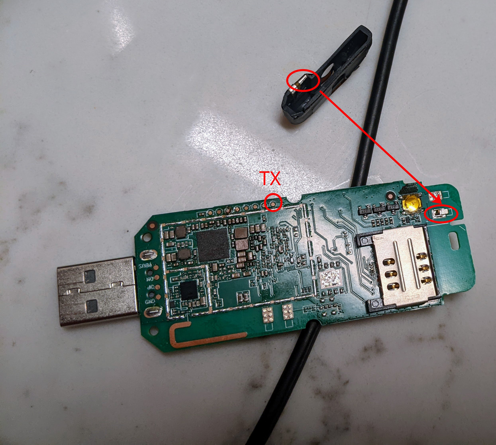

# openstick wip notes

## outstanding issues

- proper option for disabling Splash Task in stage-1
- qtestsign (lol python) still doesn't work cross-host
- wifi + lte
  - the DTB might be wrong, `wlan` module is never loaded

## usage

(note, I am building against a newer nixpkgs than this repo/PR pins)

```
nix-build --argstr device openstick -A outputs.android-abootimg
fastboot flash aboot result

nix-build --argstr device openstick -A outputs.android-fastboot-images
fastboot flash boot result/boot.img
fastboot flash -S 200M rootfs result/system.img
```

NOTE: the `aboot` built here from `lk2nd` sources (but note, is the `lk1st` make target!) is something I've
hacked on in an attempt to prevent devices from becoming semi-bricked. Please note, I have barely any
idea what I'm doing so be careful or wait for someone else to go first. Or be bold, they're fairly cheap devices...

  
## why?

 - `adb`+`fastboot` just work, it seems to present as a USB-stick-form Android device
 - can be purchased for <$10 (see "tested devices" below):
 - has LTE support
   - TODO: note about model compatibility?
 - has Wifi support
 - has at least 384MB of RAM and a swap paritition
 - some have SD card slots
 - potential GPIO support: https://www.zianet.com/jgray/openstick/14Aug2022.html
   - thought: there could be even more GPIO if we get a model with SD card? I've seen that before.
 - potential USB Gadget/Host support: https://www.zianet.com/jgray/openstick/10Aug2022.html
 - serial access (maybe dependent on exact device): https://www.zianet.com/jgray/openstick/09Aug2022.html
 - maybe bluetooth? if kernel supports? (same link ^)

with some creativity this could be a very cheap linux learning platform, the basis of a cheap
IOT project, or a much more powerful (and bulkier) rubberducky platform.

plus I just think it is a silly idea to be able to provision such cheap, devices
via something like [android-webinstall](https://github.com/kdrag0n/android-webinstall)
which, despite being Chrome-specific, would be very "cool".

## other resources:
- [extrowerk's blog (start here)](https://extrowerk.com/2022/07/31/OpenStick/)
- [openstick wiki](https://www.kancloud.cn/handsomehacker/openstick/2636505)
- [openstick hacker's "blog"? twitter?](https://blog.csdn.net/github_38345754/article/details/121481021)
- [jgray's "blog"](https://www.zianet.com/jgray/openstick/)
- [openwrt thread](https://forum.openwrt.org/t/qualcomm-msm8916-lte-router-384mib-ram-2-4gib-flash-android-openwrt/131712/38?u=colemickens)
- [the "osup" = "openstick upstream" dir](./osup) has some stuff borrowed from the debian/generic-base zips
   - [`flash-base.sh`](./osup/flash-base.sh) (the `base/flash.sh` script, seems to flash hyp + retrieve/reflash some modemy stuff?)
   - `flash-debian.sh` (the `debian/flash.sh` script)
   - `ls-base.txt` (`ls -al` from the base zip)
   - `debian-{boot,roofs}.img-file` (the `file` output of the debian imgs)
  
## other questions:
- [forcing fastboot/EDL with lk2nd and black-stick-v1](https://github.com/OpenStick/OpenStick/issues/17)

## tested devices
 - variant1: [from "Pro Sweety Baby Store" (older black or white variants?)](https://www.aliexpress.com/item/3256803964280481.html?spm=a2g0o.order_list.0.0.21ef1802DXiYI3)
   - 
   - the exact variant purchased was the "2x black" variety
   - this is labeled `UF896_V1.1` on the top of the board
   - there are eight gold pads in a row on the top edge of the bottom of the board
     if the usb connector is facing to the left
   - the right-most pad is the board's UART TX
   - there is no microSD card slot on this variant
   - **it is unclear how to force EDL mode so these are currently easy to "brick"**
     - **Question**:
     - what is the weird extra internal plastic connector piece that
       seems to depress an internal button/contact on the board?
     - <a href="https://raw.githubusercontent.com/colemickens/mobile-nixos/openstick/devices/openstick/readme-img/openstick-plastic-shunt.jpg">
        
        </a>
    
 - variant2: [from "Pro Sweety Baby Store" (newer red+white variant?)](https://www.aliexpress.com/item/3256804379039480.html?spm=a2g0o.order_list.0.0.21ef1802DXiYI3)
   - exact variant purchased was the "2x" variety
   - ... well, it has cutout for a microSD card slot, but no microSD card internals
   - yup, it's literally the eaxct same `UF896_V1.1` board...
   - and yes, all of the info on this page identically applies, I literally can't tell which is which with their case off


## status

**latest**:
 - mobile-nixos stage-2 boots, but fails to load basically all kernel modules, doesn't have anything built in and fails to boot
            
**next steps**:   
 1. (wip) flesh out the rest of `devices/openstick/default.nix` with correct partition, device id, usb ids, etc
 2. kernel -
    seems like tons of modules are missing, breaking stage-2?

 3. firmware - better origin?    
    - [already asked on OpenStick about a better origin for firmware than just copying from them](https://github.com/OpenStick/stick-blobs/issues/2)
    - check on ABL passing firmware_path on cmdline and overriding us


## bonus todo:
- build `hyp.bin` from source, or at least get it from the upstream repo's releases?
  - no idea if it's the exact same one: https://github.com/msm8916-mainline/qhypstub
  - not sure if there's really a whole huge point to this?  


## Physical HW

Test Pads (from the "left"; test pads facing up; usb plug on the left)
1. ?
2. GPIO35
3. Serial RX (from mobile-nixos booted anyway)
4. GPIO22
5. ?
6. ?
7. ?
8. Serial TX

Physical Reset Button = GPIO35

### debian image experimentation

first:
- follow the instructions from extrowerk to flash the generic-base and debian image.

then:
- `adb shell` into it
- set a `TERM`
- `nmtui` to connect to a network
- `apt update` + `apt install curl fdisk`
- `systemctl start sshd` to start sshd
- `useradd -m cole` + `gpasswd -a cole sudo` to add a sudo enabled user
- `mkdir /home/cole/.ssh/`
- download your ssh key into there
- fixup .ssh dir + auth_key file perms to make ssh happy

```
❯ ssh cole@192.168.124.115
Linux openstick 5.15.0-handsomekernel+ #17 SMP PREEMPT Sun Feb 6 22:10:37 CST 2022 aarch64

The programs included with the Debian GNU/Linux system are free software;
the exact distribution terms for each program are described in the
individual files in /usr/share/doc/*/copyright.

Debian GNU/Linux comes with ABSOLUTELY NO WARRANTY, to the extent
permitted by applicable law.


$ uname -a
Linux openstick 5.15.0-handsomekernel+ #17 SMP PREEMPT Sun Feb 6 22:10:37 CST 2022 aarch64 GNU/Linux


$ top
top - 23:01:31 up  1:59,  1 user,  load average: 0.03, 0.09, 0.05
Tasks: 109 total,   1 running, 108 sleeping,   0 stopped,   0 zombie
%Cpu(s):  1.4 us,  2.7 sy,  0.0 ni, 95.9 id,  0.0 wa,  0.0 hi,  0.0 si,  0.0 st
MiB Mem :    382.1 total,     77.3 free,     73.9 used,    230.9 buff/cache
MiB Swap:    191.0 total,    190.5 free,      0.5 used.    297.3 avail Mem


$ ls /lib/firmware
mba.mbn    modem.b03  modem.b08  modem.b14  modem.b18  modem.b25  regulatory.db  wcnss.b04  wcnss.b11
modem.b00  modem.b04  modem.b09  modem.b15  modem.b21  modem.b26  wcnss.b00	 wcnss.b06  wcnss.mdt
modem.b01  modem.b05  modem.b12  modem.b16  modem.b22  modem.mdt  wcnss.b01	 wcnss.b09  wlan
modem.b02  modem.b06  modem.b13  modem.b17  modem.b23  qcom	  wcnss.b02	 wcnss.b10


$ sudo ip link
1: lo: <LOOPBACK,UP,LOWER_UP> mtu 65536 qdisc noqueue state UNKNOWN mode DEFAULT group default qlen 1000
    link/loopback 00:00:00:00:00:00 brd 00:00:00:00:00:00
2: usb0: <BROADCAST,MULTICAST,UP,LOWER_UP> mtu 1500 qdisc pfifo_fast state UP mode DEFAULT group default qlen 1000
    link/ether 46:d7:70:a3:6e:15 brd ff:ff:ff:ff:ff:ff
3: wlan0: <BROADCAST,MULTICAST,UP,LOWER_UP> mtu 1500 qdisc mq state UP mode DORMANT group default qlen 1000
    link/ether 02:00:01:a5:af:20 brd ff:ff:ff:ff:ff:ff
4: wwan0: <POINTOPOINT,NOARP> mtu 1500 qdisc noop state DOWN mode DEFAULT group default qlen 1000
    link/[519]
5: wwan1: <POINTOPOINT,NOARP> mtu 1500 qdisc noop state DOWN mode DEFAULT group default qlen 1000
    link/[519]
6: wwan2: <POINTOPOINT,NOARP> mtu 1500 qdisc noop state DOWN mode DEFAULT group default qlen 1000
    link/[519]
7: wwan3: <POINTOPOINT,NOARP> mtu 1500 qdisc noop state DOWN mode DEFAULT group default qlen 1000
    link/[519]
8: wwan4: <POINTOPOINT,NOARP> mtu 1500 qdisc noop state DOWN mode DEFAULT group default qlen 1000
    link/[519]
9: wwan5: <POINTOPOINT,NOARP> mtu 1500 qdisc noop state DOWN mode DEFAULT group default qlen 1000
    link/[519]
10: wwan6: <POINTOPOINT,NOARP> mtu 1500 qdisc noop state DOWN mode DEFAULT group default qlen 1000
    link/[519]
11: wwan7: <POINTOPOINT,NOARP> mtu 1500 qdisc noop state DOWN mode DEFAULT group default qlen 1000
    link/[519]
```
