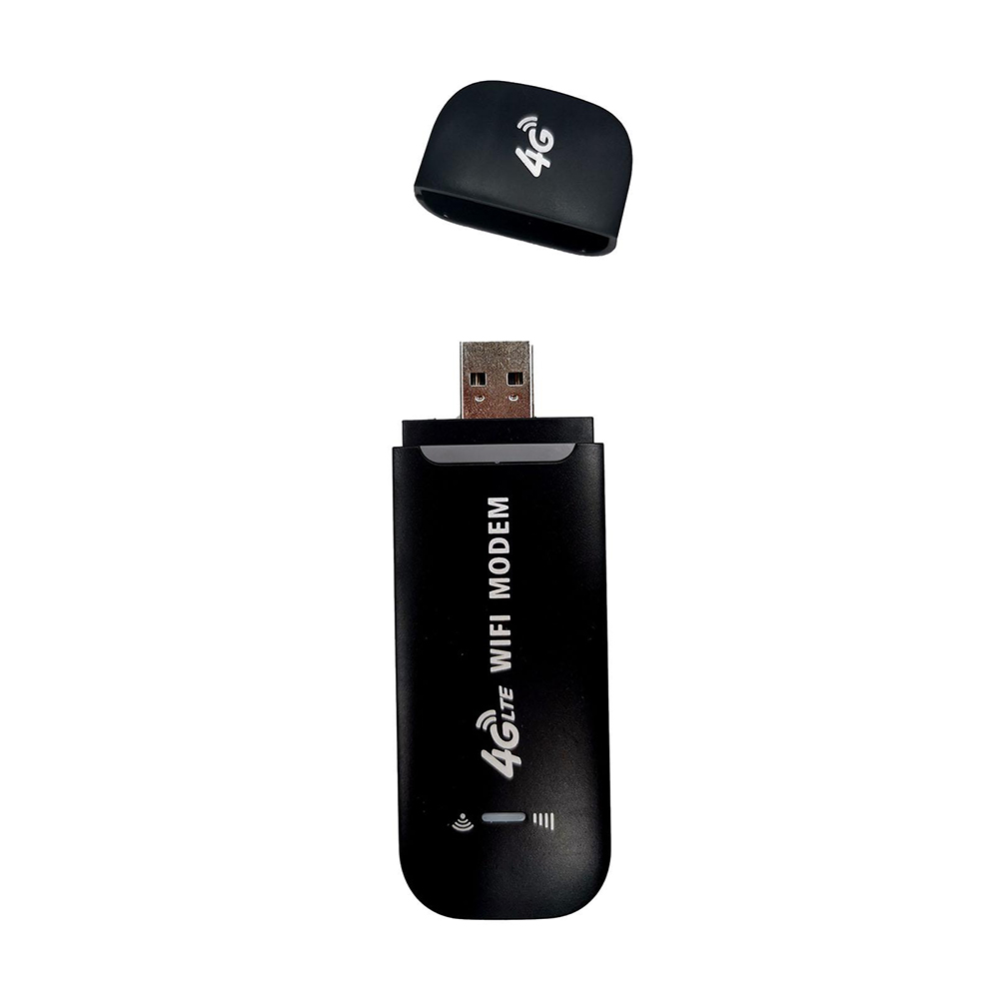
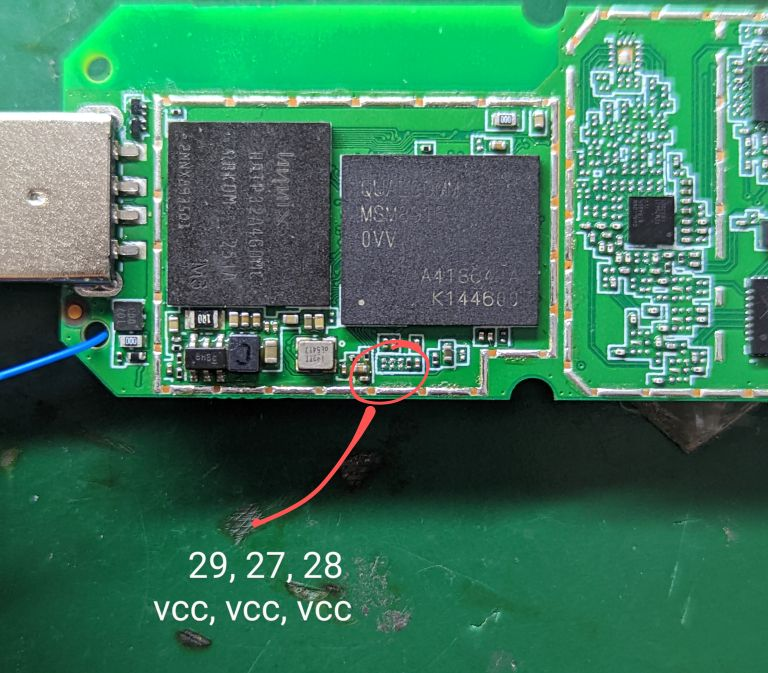

# openstick wip notes

## state

* Wifi = *works*
* Boot = *works*
* Aboot -> fastboot = *works*
* LTE modem = **not showing up in `ip a`**
  * haven't really investigated too much


## todo
  0. mobile-nixos: add option for disabling splash/drm entirely
  0. mobile-nixos: qtestsign: make work in cross-arch scenario
  0. openstick: flesh out the rest of `devices/openstick/default.nix` with correct partition, device id, usb ids
  0. openstick: fix up ADB
  0. openstick: checkup kernel config, might be missing somethings for modem
  0. openstick: fixup modem, it was at least detected in debian
  0. openstick: firmware: better source/origin? is it better to use the original extracted vs what I'm pulling from openstick's debian image?
  0. openstick: what even is `setup-wcnss`, should it be enabled, fix it?


## sources/forks
- `linux` kernel:
  - my fork, adding a device-tree for `UF896_V1_1`
  - https://github.com/colemickens/linux/tree/openstick
  - "upstream" pull request: https://github.com/OpenStick/linux/pull/3
- `aboot` / `lk2nd` (ala `lk1st`)
  - target: `msm8916-lk1st`
  - my fork, fixes support for reset button to get into fastboot
  - https://github.com/colemickens/lk2nd/tree/openstick
  - no "upstream" pull request, not sure what to do with it long(er) term


## usage

(note, I am building against a newer nixpkgs than this repo/PR pins)

```
nix-build --argstr device openstick -A outputs.android-abootimg
fastboot flash aboot result

nix-build --argstr device openstick -A outputs.android-fastboot-images
fastboot flash boot result/boot.img
fastboot flash -S 200M rootfs result/system.img
```

  
## why?

 - `adb`+`fastboot` just work, it seems to present as a USB-stick-form Android device
 - can be purchased for <$10 (see "tested devices" below):
 - has LTE support
   - TODO: note about model compatibility?
 - has Wifi support
 - has at least 384MB of RAM and a swap paritition
 - some have SD card slots
 - potential GPIO support: https://www.zianet.com/jgray/openstick/14Aug2022.html
   - thought: there could be even more GPIO if we get a model with SD card? I've seen that before.
 - potential USB Gadget/Host support: https://www.zianet.com/jgray/openstick/10Aug2022.html
 - serial access (maybe dependent on exact device): https://www.zianet.com/jgray/openstick/09Aug2022.html
 - maybe bluetooth? if kernel supports? (same link ^)

with some creativity this could be a very cheap linux learning platform, the basis of a cheap
IOT project, or a much more powerful (and bulkier) rubberducky platform.

plus I just think it is a silly idea to be able to provision such cheap, devices
via something like [android-webinstall](https://github.com/kdrag0n/android-webinstall)
which, despite being Chrome-specific, would be very "cool".

## other resources:
- [extrowerk's blog (start here)](https://extrowerk.com/2022/07/31/OpenStick/)
- [openstick wiki](https://www.kancloud.cn/handsomehacker/openstick/2636505)
- [openstick hacker's "blog"? twitter?](https://blog.csdn.net/github_38345754/article/details/121481021)
- [jgray's "blog"](https://www.zianet.com/jgray/openstick/)
- [openwrt thread](https://forum.openwrt.org/t/qualcomm-msm8916-lte-router-384mib-ram-2-4gib-flash-android-openwrt/131712/38?u=colemickens)
- [the "osup" = "openstick upstream" dir](./osup) has some stuff borrowed from the debian/generic-base zips
   - [`flash-base.sh`](./osup/flash-base.sh) (the `base/flash.sh` script, seems to flash hyp + retrieve/reflash some modemy stuff?)
   - `flash-debian.sh` (the `debian/flash.sh` script)
   - `ls-base.txt` (`ls -al` from the base zip)
   - `debian-{boot,roofs}.img-file` (the `file` output of the debian imgs)
  

## tested devices
 - variant1: [from "Pro Sweety Baby Store" (older black or white variants?)](https://www.aliexpress.com/item/3256803964280481.html?spm=a2g0o.order_list.0.0.21ef1802DXiYI3)
   - 
   - the exact variant purchased was the "2x black" variety
   - this is labeled `UF896_V1.1` on the top of the board
     if the usb connector is facing to the left
   - there is no microSD card slot on this variant
    
 - variant2: [from "Pro Sweety Baby Store" (newer red+white variant?)](https://www.aliexpress.com/item/3256804379039480.html?spm=a2g0o.order_list.0.0.21ef1802DXiYI3)
   - different case, but otherwise identical board


## Physical HW

* Physical Reset Button = GPIO35

### Test Pads

*from the "left"; test pads facing up; usb plug on the left*

1. (not sure, pulling down doesn't trigger it?)
2. GPIO35 (confirmed, pull down resets linux cleanly)
3. Serial RX (from mobile-nixos booted anyway)
4. GPIO22 (uh,.... can't confirm this now but I thought I did from debian??)
5. pad 5 is GPIO0 (pulled down by default) (credit @infowski)
6. HARD_RESET (pull down immediately resets?) (GPIO37, aka EDL trigger)
7. ?
8. Serial TX


### Extra Pins

**credit to `@informatic:hackerspace.pl`**

  - <a href="https://raw.githubusercontent.com/colemickens/mobile-nixos/openstick/devices/openstick/readme-img/openstick-extra-pins.jpg">
    
    </a>

### EDL Recovery Mode

**credit to `@informatic:hackerspace.pl`**

* bridge test **pad 1** + **pad 6** while plugging in USB, hold for 5+ seconds before releasing
  * (again, as before, usb plug on the left, test pads on the top, counting from the left)
